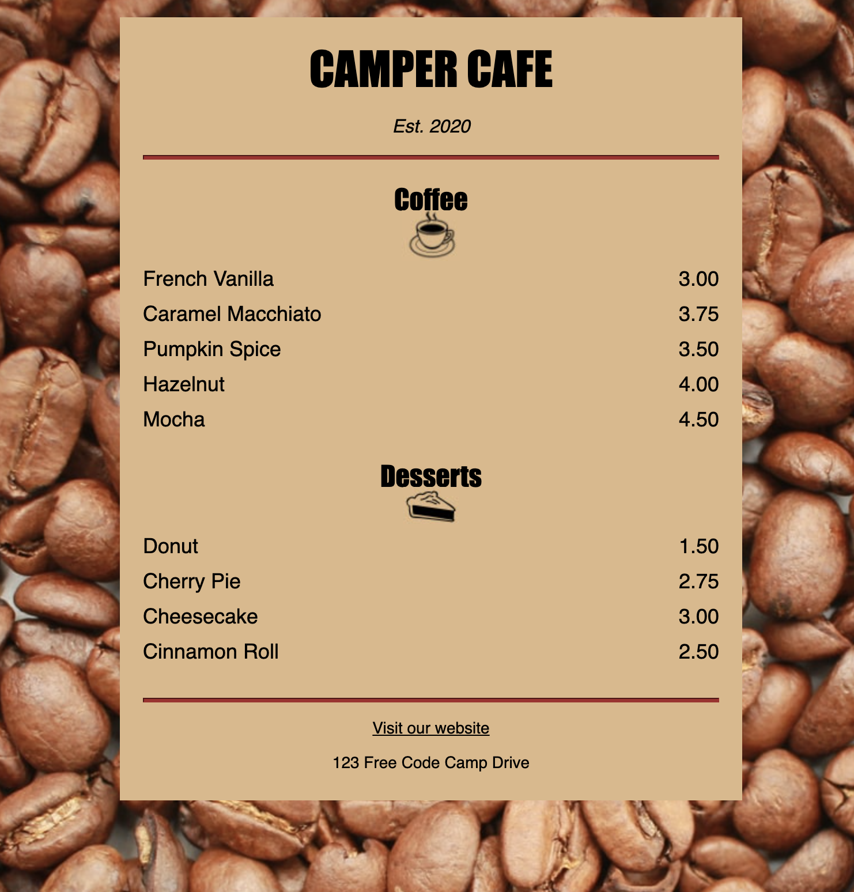

# CafeMenuCSS
Learning CSS by building cafe menu from FreeCodeCamp

## Notes
### Elements: 
- Style
    - Change property of the element by: element{property:value} in style element. 
- div: used to group similar elements together
- hr: used to display a divider (a horizontal line)

- putting another font in front after existing is used for backup in case first font does not exist. 
- Styles can also be kept in a css folder and linked to with "<link rel="stylesheet", href="styles.css">"
- For the page styling to look similar across devices, you need "<meta name="viewport" content="width=device-width, initial-scale=1.0" />" 
- to select id use "#"
- to select class use "."
- to select items within class, select class then add item after. (ex. .item p{})
- comment with /* ... */ 
- to change color of hyperlink after it has been visited use pseudo-selector: a:visted as the element; 
    - Similarily, if someone hovers it, it can be customized with a:hover. 
    - pseudo-selector for when the link is being clicked on is a:active; 
- You can use negative parameters for some inputs such as margin. 

## Completed Image

